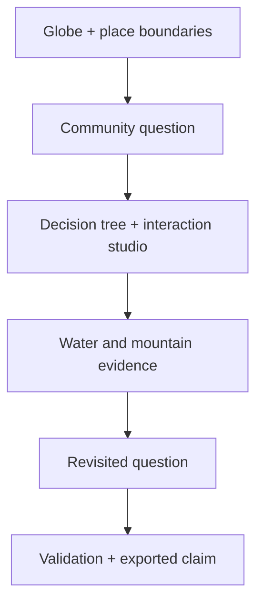

# Version 3 visual-story blueprint and release gate

Mode: **rich-editorial teaching interface with minimal-scientific evidence views**. Scientific accuracy and evidence status override visual drama.

## Section-to-visual map

| Sequence | Story role | Reader question | Visual / interaction | Evidence class | Expected takeaway | Introduced / interpreted |
| --- | --- | --- | --- | --- | --- | --- |
| 1. Orient | Framing | Where are Kunshan and Mandara, and why are they here? | 3D globe, two markers, three source layers | geographic + schematic | The places and sources are distinct; the arc is a question, not a route | Opening statement / globe caption + place cards |
| 2. Question | Framing | What should this project help someone ask? | three persistent community lenses over credited photography | prospective + interpretive | A learning need precedes a control | question heading / evidence boundary |
| 3. Design | Mechanism | Which interaction fits the question and evidence? | four-layer decision tree, six-pattern studio, research theatre, Colab guide | methodological + pedagogical | Every control needs an action, response, learning effect and recovery | tutorial heading / live recommendation + five-line script |
| 4. Sources | Evidence | What is actually in each source? | inspectable source records | observed + modeled + inferred | Source status and limitations travel with the data | evidence heading / source boundary |
| 5. Water | Evidence | What can mapped channels and precipitation reveal separately? | OSM map + fixed-scale monthly timeline | mapped + modeled | Waterway geometry must not animate as rainfall or flow | chapter copy / method strip |
| 6. Mountain | Evidence | What turns a sherd record into CP1–CP14? | page book, glossary, CP guide, matrix, local importer | observed → inferred → interpretive | CP numbers identify latent decoration patterns, not peoples or chronology | CP explainer / source note + cell reading |
| 7. Revisit | Implication | Did the evidence change the community question? | persistent lens + paired place prompts + notebook | interpretive + prospective | Keep observation, interpretation and question separate | bridge heading / evidence boundary + note |
| 8–9. Validate + return | Implication | What could disprove or improve the claim? | four validation levels + portable team claim | evaluative + prospective | A responsible design ends with a next check and accountable source trail | validation prompt / exported post |

## Existing-visual audit and decisions

| Previous visual | Reader task | Decision | Reason |
| --- | --- | --- | --- |
| Overlapping photo hero | encounter the places | **Split and reorder** | Photography could not answer “where?”; globe now orients first and question photography follows. |
| Chinese-only quotation | frame the metaphor | **Translate + source + bound** | Global readers need pinyin, English, passage number, URL and a clear non-evidence status. |
| Six-pattern studio | learn interaction vocabulary | **Keep + contextualize** | It has a distinct teaching task; the selected community lens and decision tree now give it purpose. |
| Six small research cards | inspect precedents | **Merge into theatre** | One large, replayable example reduces illegible simultaneous thumbnails and foregrounds applied/reference/extension status. |
| CP matrix without prior definition | compare reported signatures | **Precede with explainer** | Unexpanded CP labels created a scientific and interdisciplinary comprehension blocker. |
| Five Site 642 sequences | inspect depth narratives | **Keep as optional detail** | Useful after the model/evidence distinction, not before it. |

## Ranked additions

Scores use 1–5 for scientific value (S), communication value (C), cognitive-load reduction (L), evidence availability (E), page-cost efficiency (P), and teaching impact (I).

| Priority | Addition | S | C | L | E | P | I | Decision |
| --- | --- | ---: | ---: | ---: | ---: | ---: | ---: | --- |
| MUST HAVE | bilingual global orientation | 5 | 5 | 5 | 5 | 4 | 5 | implemented |
| MUST HAVE | CP transformation book + glossary | 5 | 5 | 5 | 5 | 4 | 5 | implemented |
| HIGH | bounded designer decision tree | 4 | 5 | 4 | 5 | 4 | 5 | implemented |
| HIGH | executable Colab companion | 4 | 5 | 4 | 5 | 4 | 5 | implemented |
| HIGH | enlarged animation theatre | 3 | 5 | 4 | 5 | 4 | 4 | implemented |
| NOT RECOMMENDED | animated water-flow layer | 1 | 3 | 1 | 1 | 2 | 1 | rejected: would imply unsupported flow |
| NOT RECOMMENDED | map of individual Mandara excavation points | 2 | 3 | 2 | 1 | 3 | 2 | rejected: precise coordinates are not in the bundled evidence |

## Figure dependency map

The Colab companion depends on the same three bundled snapshots as the live chapters. The CP matrix depends on the CP explainer, not the reverse.

## Semantic encoding and terminology map

| Meaning | Encoding | Redundancy / boundary |
| --- | --- | --- |
| Kunshan | cyan marker + name + coordinates | color never appears without text |
| Mandara study region | coral marker + name + approximate-region label | no excavation precision implied |
| question bridge | dashed gold arc + caption | explicitly not a route, migration or causality |
| observed/mapped | source label + plain-language record | separated from modeled/inferred states |
| modeled climate | source label + units + fixed scale | not flow, flood or gauge data |
| inferred CP | CP prefix + “model pattern identifier” | not people, chronology, name or rank |
| teaching transcription | interpretive badge + three-level legend | zero means “not asserted,” never proven absence |

## Release gate

Scientific blockers are resolved in source: geography precision, quotation provenance, CP semantics, modeled/observed/inferred status, and the non-causal arc are explicit. Interaction tests cover every new control family. The notebook is parsed and inspected during `npm run check`.

Layout, crop, font fallback, WebGL performance and real reduced-motion behavior still require a public-browser acceptance pass at 1440, 1024, 768 and 390 px. Until that pass is recorded, visual disposition remains **recapture** rather than visually certified.
